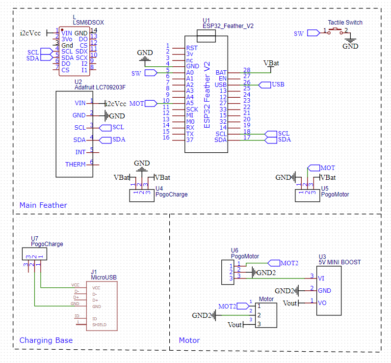

# Firmware

This is the set of files where we use the Adafruit components to reduce the size, the M5 was quite thick and didn't have some features that we wanted so we changed our electronic components.

# Hardware

## List of key components
- [ESP32 Feather V2](https://www.adafruit.com/product/5400)
- [LSM6DSOX 6 DoF Accelerometer and Gyroscope](https://www.adafruit.com/product/4438)
- [LC709203F LiPoly / LiIon Fuel Gauge and Battery Monitor](https://www.adafruit.com/product/4712)
- [Tactile Switch Buttons(12x12x6)](https://www.adafruit.com/product/1119)
- [Pogo Pin Connectors](https://shopee.sg/5-Pairs-Spring-Loaded-Magnetic-Pogo-Pin-Connector-3-Positions-Magnets-Pitch-2.3MM-Through-Holes-Male-Female-Probe-i.174316421.13592238478?sp_atk=ab548fd7-1fb2-4dd6-9592-12ebe74c2071&xptdk=ab548fd7-1fb2-4dd6-9592-12ebe74c2071)
- [Vibration Motor Module](https://shopee.sg/PWM-Vibration-Motor-Module-DC-Motor-Mobile-Phone-Vibration-Vibrator-Mini-Switch-Sensor-Module-DIY-for-Arduino-DC-5V-i.56539845.10481910192)
- [1500mah Lipo Battery](https://www.continental.sg/3-7v-rechargeable-1500mah-li-po-battery.html) - Continental Electronics, Sim Lim Square
- [5V Boost Converter](https://shopee.sg/5pcs-lot-0.9-5V-To-5V-DC-DC-Step-Up-Power-Module-Voltage-Boost-Converter-Board-1.5V-1.8V-2.5V-3V-3.3V-3.7V-4.2V-To-5V-i.56539845.12267989957)

## Adafruit
Note that we chose Adafruit because their components are of pretty solid quality and their STEMMA QT Cables are pretty useful for the i2c wiring. We also used that ESP32 feather because it came with battery charging capabilities. 

The pogo pin connectors were used for charging and for connecting the upper casing to the lowercasing. The lower casing houses the Vibration Motor as it needs to be close to the skin.

The tactile switch buttons we used are slightly bigger than the typical ones, and are generally alot easier to press. 

Note that the LiPo batteries must be bought locally, as they take very long to be shipped over. They also must be treated carefully and cannot be pierced by screws/sharp parts or overcharged. The Feather handles this well.

The Motor is connected to a Boost Converter to as it will increase the voltage across the motor and hence the magnitude of vibration

## Electrical Circuits

Note that the LIPO Battery should be connected to the LC709203F via JST, then the other JST cable from the LCF70920 will run to VBat in the Huzzah and the the Ground wire connects to GND.

# Software

The communication relied on [ESP-NOW](https://randomnerdtutorials.com/esp-now-esp32-arduino-ide/), with the MAC ADDRESSES specified in the codes. The Feather with the motor is denoted as the **Slave** while the one without is denoted as the  **Master**. The Slave calculated the orientation and transmits it to the Master. The Master then calculated the joint angle in this format, with maximum flexion being 0 degrees. This was advised by Mark from Active Global

    joint_angle = 180 - abs(180 - int(abs(slave_angle - roll)));

The Master then uses ESP-NOW to transmit data to the M5. The M5 then processes the joint angle from multiple Feathers and transmits it to the Raspberry Pi via Serial to be processed. When the Raspberry Pi senses that a patient has completed a repetition by hitting the max/min, it sends the patient number via Serial to the M5. The M5 then sends an ESP-NOW message to the Slave, which will vibrate the motor. 

The orientation is calculated via the AHRS algorithm provided by [MadgwickAHRS Library](https://github.com/arduino-libraries/MadgwickAHRS). As the Magdwick Algorithm relies on gradient descent, we found that the first few seconds of data were generally inaccurate as it was still descending to the actual position. As such, the first 10s of readings were ignored, and data only starts to be transmitted after that.

The Magdwick Algorithm calculated roll and pitch. However, we needed Yaw, as this was the optimal placement of the LSM in the wearable. As such, the frame was rotated and fed into the Magdwick Algorithm, such that the roll calculated is actually the Yaw.

    //filter.updateIMU(gx, gy, gz, ax, ay, az);  //Original
    filter.updateIMU(gz, gy, -1.0*gx, az, ay, -1.0*ax); //Yaw, rotated > used

I also noted that the readings were incredibly noisy when the LSM faced upwards, with its Z axis pointing up. I believe its because only one axis is used. Once it is tilted, it is able to utilise readings from multiple axis. Refer to (this)[https://community.nxp.com/t5/Sensors/6DOF-GY-KALMAN-Yaw-drift/m-p/457552] forum post i found.

## Notes
Note that PATIENT_NO = 0 is old prototype with the IMU rotated and holes in the board  Hence, the Battery indicator brightness is lower and the orientation calculation is different. These are accounted for in the code with if else statements

# Mac Addresses

M5
- {0x4C,0x75,0x25,0xC4,0xFA,0xF4}; 

Patient 1 (NEW) -> purely grey
- New Master: {0xE8,0x9F,0x6D,0x26,0x09,0x20}
- New Slave: {0xE8,0x9F,0x6D,0x1F,0xFD,0xB8}

Patient: 0 (OLD PROTO) -> Large prototypes
- Old Master: {0xE8,0x9F,0x6D,0x25,0x3C,0x24}
- Old Slave:  {0xE8,0x9F,0x6D,0x28,0x0C,0x98}

Patient 2 (Newest Feathers) - Turqoise Casing
- Master: {0xE8,0x9F,0x6D,0x25,0x47,0x08}
- Slave:{0xE8:0x9F,0x6D,0x25,0x46,0x70}

