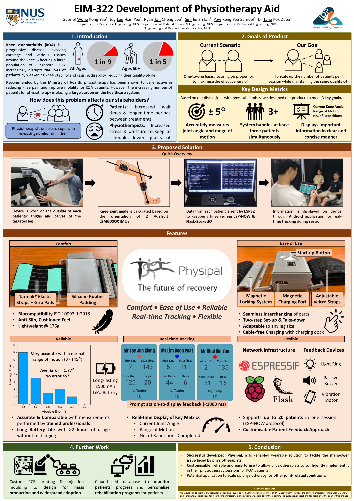

# Development of a Physiotherpay Aid
A project done by EIM322 with the National University of Singapore's Innovation and Design Programme([iDP](https://cde.nus.edu.sg/idp/academics/overview/)). Under the Innovating for a Better Healthcare Track, we propose the use of multiple knee wearables during group physiotherapy sessions, allowing physiotherapists to identify patients that are struggling and devote more time into correcting their form or modifying their individual exercises.

